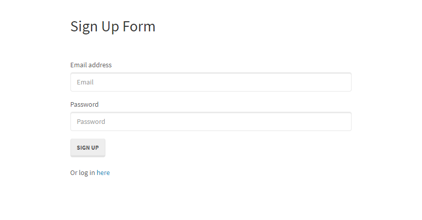

# Reverse Engineering
## Description
This README will go into the reverser engineering of a simple sign-up and login application. This login application uses Passport and Sequelize to authenticate users and stores that information in the database. This app also uses Express to reset everytime the app is launched. In addition, the app uses Bcrypt to secure passwords in a database.

## User Story
```
GIVEN a Node.js application using Sequelize and Passport
WHEN I follow the walkthrough
THEN I understand the codebase.
```
## Sign Up Page Image



## Installation

To install dependencies run:
```
npm install
```
To run locally with node:
```
node server.js
```

Create a new database on MySQL called "passport_demo".
```
CREATE DATABASE IF NOT EXISTS passport_demo;
```


## The Nitty-Gritty


The server.js requires the packages that are necessary to the middleware: Passport, session, express.json. Setting up the express app in our server.js sets the middleware necessary for authentication. We then use sessions to track the user's logins. In this file is where we also require our html-routes.js and api-routes.js and at the very bottom, we sync our database that listens for requests to the express app.

Jumping into our models folder, we have the index.js and user.js. The index.js connects to the database and checks the configs in our config.json. The user.js file requires Bcrypt for password hashing making it more secure and defines a new model (table) with the user's email and password; we also see constraints for the email and password. The `User.prototype.validPassword` on line 27 is a Password strategy checking for the right credentials. On line 32 we see beforeCreate hook that hashes their password. 

Once these files have been created we can see on the appication page there is a page that has you create an account with an email and password. This page sends a post request to create a new user using the information they used. If we look at our api-routes.js, we see that on line 22, and 307 directs them to the login page, if there is an error, a 404 status will appear. 

On line of the api-routes.js we see `passport.authenticate("local")` as the middleware that will pass the request to the local strategy that verifies the login credentials. Within the local strategy we use sequelize to find the user's email and password to make sure it is valid. Finally the callback function returns with successful authentication with the user's input for their email and password. 

The window then reloads after the form has send a post request to the signup route and we see the member's page. In our html-routes.js we see a redirect to the member page. This page has a get request that has an isAuthenticated middleare function. With this, we restrict routes as the isAuthenticated.js goes into so that if a user that isn't logged in trues accessing the memeber route, they will be redirected to the sign up page. 


## Authors

* **Leslie Villatoro** 

- [Link to Github](https://github.com/leslievill)
- [Link to LinkedIn](https://www.linkedin.com/in/leslievillatoro/)

